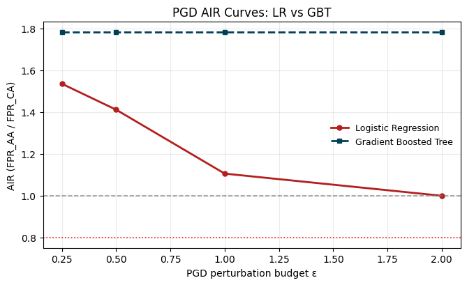
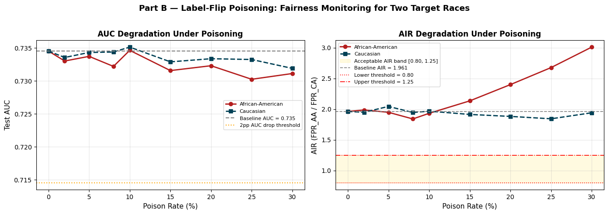
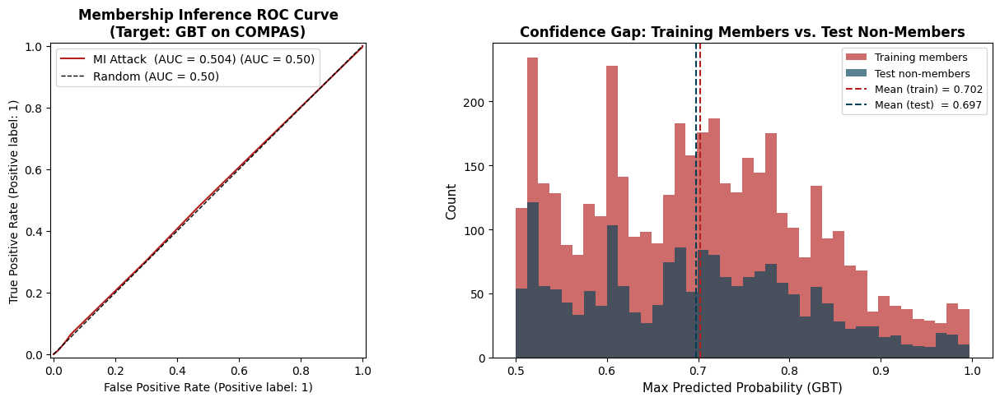

## Introduction

This report condenses the notebook evidence for the three audits and the reflection question. Figures appear once in the body; the appendix holds the supporting tables.

## 1. PGD Evasion Audit

Across $\epsilon \in \{0.25, 0.5, 1.0, 2.0\}$, logistic regression is more attack-sensitive than GBT: LR AIR drops from 1.535 to 1.000, while GBT stays flat at 1.782. Neither model crosses AIR = 0.80, but LR is less stable under perturbation. See Appendix A for the compact PGD summary.

## 2. Poisoning Loop with Fairness Monitoring

The poisoning sweep is stealthy: AUC stays within 2 percentage points of baseline (0.735), but AIR leaves [0.80, 1.25] for both target races. African-American-target poisoning is worse, reaching AIR ≈ 3.01 at 30%; the Caucasian-target variant stays around 1.84–2.04. The stealth zone covers the full tested grid, and PSI stays at 0.0000. See Appendix B for the compact evidence table.

## 3. Membership Inference Depth

Membership inference remains near chance. LR MI AUC is 0.4970 and GBT MI AUC is 0.5057; the larger GBT generalization gap does not produce meaningful leakage. LR regularization is also flat, with MI AUC staying between 0.4925 and 0.5048 across $C \in \{0.01, 0.1, 1.0, 10.0\}$. See Appendix C for the compact summary.

## 4. Reflection

The highest-risk finding is the label-flip poisoning attack. AUC barely changes, PSI stays at 0.0000, and AIR degrades sharply; the African-American-target variant reaches AIR = 3.01 at 30% poisoning. A proactive control is label provenance and validation before retraining, which would avoid about 1.05 AIR units of harm relative to the poisoned endpoint. A reactive control is subgroup AIR monitoring with rollback; it would flag all poisoned cases here, while PSI would flag none. The largest benefit accrues to African-American defendants.

## Appendix

### Appendix A. PGD Summary

| Model | AIR at $\epsilon=0.25$ | AIR at $\epsilon=2.0$ | Crosses 0.80? |
|---|---:|---:|---|
| Logistic Regression | 1.535 | 1.000 | No |
| Gradient Boosted Tree | 1.782 | 1.782 | No |

### Appendix B. Poisoning Evidence

| Target race | Clean AUC | Max AIR observed | PSI max | Stealth-zone outcome |
|---|---:|---:|---:|---|
| African-American | 0.735 | 3.010 | 0.0000 | Full tested grid |
| Caucasian | 0.735 | 2.040 | 0.0000 | Full tested grid |

### Appendix C. Membership Inference Evidence

| Model | MI AUC | Train AUC | Test AUC | Gen Gap |
|---|---:|---:|---:|---:|
| Logistic Regression | 0.4970 | 0.7269 | 0.7345 | -0.0077 |
| Gradient Boosted Tree | 0.5057 | 0.7981 | 0.7179 | 0.0802 |

LR C sweep: 0.01 -> 0.5048, 0.10 -> 0.4925, 1.00 -> 0.4970, 10.00 -> 0.4957; the sweep stays near chance and does not materially change test AUC.